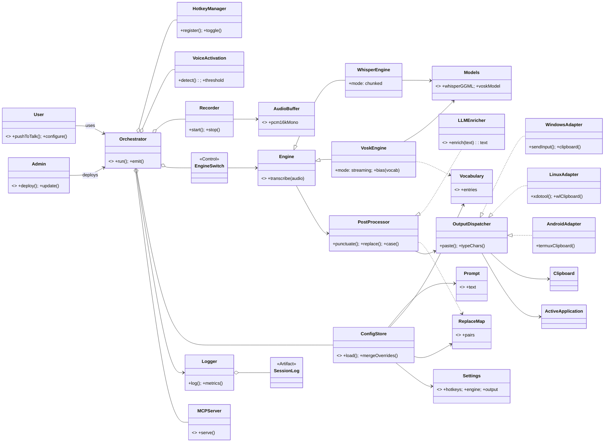
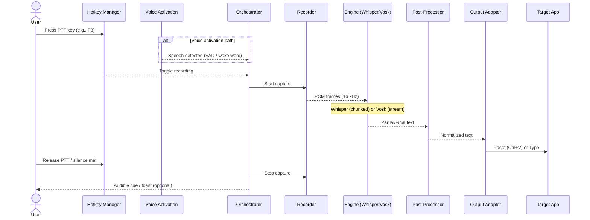
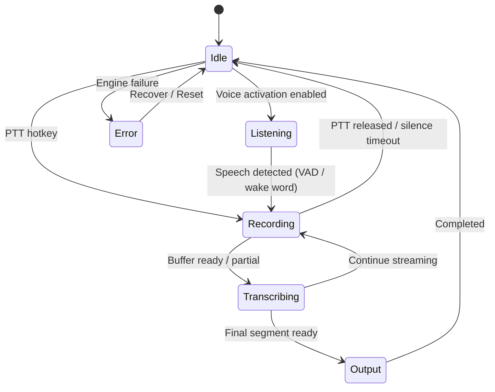
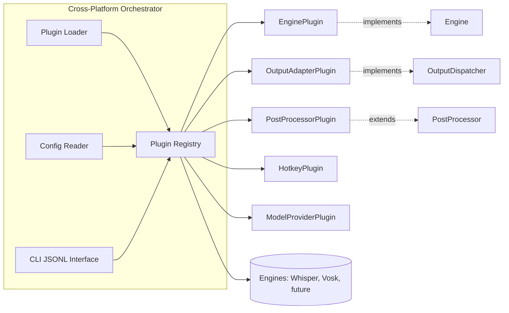
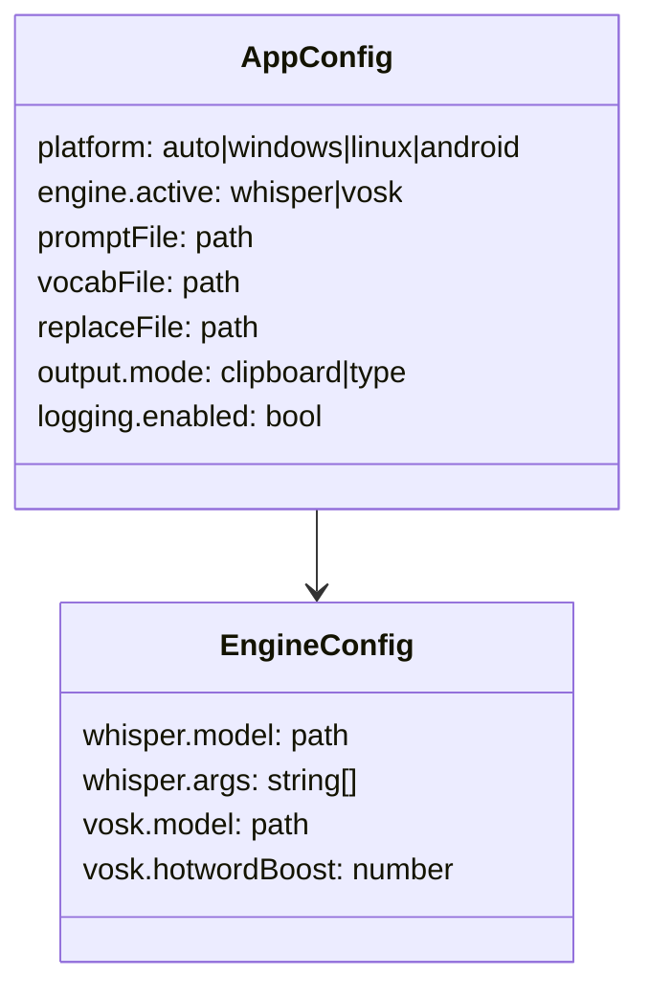

# Vision: Bavaria Dictation (voice-transcription-ahk)

Local, privacy-first, real-time dictation that transcribes your voice with high accuracy, low latency, and zero cloud dependencies. Centered on a single Rust core (orchestrator) for cross‑platform reliability; integrates Whisper.cpp (accuracy) and Vosk (speed) as pluggable engines. Optional Windows tray UI can exist as a plugin, not a dependency.

## Product Pillars
- Offline-only: 100% on-device; no telemetry by default.
- Single core binary: Rust orchestrator handles hotkeys/voice activation, audio I/O, engines, and output.
- Accuracy vs. latency: Whisper (chunked, accurate) + Vosk (streaming, fast with biasing).
- Minimal friction: push‑to‑talk hotkey or voice activation (VAD/wake word); paste or type into the focused app.
- Config-first: strict, versioned config with schema; user overrides and CLI/env for quick tweaks.
- Extensible: plugin APIs for engines, post‑processors (incl. DSPy/LLM), output adapters, hotkeys, model providers, MCP server.

## Success Metrics (from PRD)
- Accuracy: <= 10% WER on in-class sample.
- Latency: ~1s time-to-text after utterance end (Whisper), ~400ms/word (Vosk stream).
- Setup: ~5 minutes first run; 90% user satisfaction (>= 4/5) in pilot.
- Privacy: 100% offline; only opt-in manual update checks.

## System Architecture
```mermaid
flowchart LR
  user((User)) --> hk[Hotkey Manager\nWinAPI/X11/Wayland]
  user --> va[Voice Activation\nVAD + optional Wake Word]
  hk --> core
  va --> core

  subgraph core[Orchestrator (Rust)]
    ac[Audio Capture\nWASAPI/ALSA/AAudio via cpal]
    rb[Audio Buffer\nPCM 16 kHz mono]
    sw{Engine Switch}
    wW[Whisper Engine]
    wV[Vosk Engine]
    pp[Post-Processor\nPunctuation, Replacements, Casing]
    oa{Output Adapter}
    bus[Event Bus\nJSONL over STDOUT\n(local socket optional)]
  end

  ac --> rb --> sw --> wW --> pp
  sw --> wV --> pp
  pp --> oa --> app[Focused Application]
  core --> bus

  subgraph adapters[Platform Adapters]
    win[Windows: SendInput/Clipboard]
    lin[Linux: xdotool | wl-clipboard | portals]
    and[Android: Termux clipboard]
    tray[(Optional Windows tray UI)]
  end
  oa --> win
  oa --> lin
  oa --> and
  hk --> tray

  subgraph cfg[Config + Assets]
    config[(config/app.json + app.user.toml\nCLI/env overrides)]
    models[(models: Whisper ggml, Vosk)]
    logs[(logs: per-session, structured)]
  end

  config --> core
  models --> wW
  models --> wV
  core --> logs
```

## Privacy & Safety
- Offline by default; no background network. Any remote enrichment is explicit opt-in and visibly labeled.
- Logs are local-only with user-controlled retention and PII redaction.
- Robust error handling: clipboard restore on failure; path quoting; Unicode-safe I/O.

Config layers
- Canonical: `config/app.json` (schema-validated)
- User overrides: `config/app.user.toml` (merged on load)
- Fast overrides: CLI flags and environment variables

## Domain Ontology


## User Flow (Push‑to‑Talk or Voice Activation)


## Runtime States


## SLOs & Budgets
- Accuracy: ≤ 10% WER on domain samples (Whisper default); document tradeoffs by model size.
- Latency: ≤ 1s end-of-utterance (Whisper); ~400ms/word streaming (Vosk) on target hardware.
- CPU/RAM: stay within device budgets; degrade gracefully (smaller model, engine switch) if exceeded.
- Energy/Thermal (2nd–5th order): avoid sustained max CPU; provide power-aware presets; warn on thermal throttling (mobile/laptops).

## Orchestrator & Plugin Ecosystem


### Plugin Contracts
- EnginePlugin: spawn/attach, stream partials, emit finals, report metrics; deterministic test mode.
- OutputAdapterPlugin: paste/type with retries; Unicode-safe; clipboard restore guarantees.
- PostProcessorPlugin: punctuation, casing, replacements; idempotent; optional LLM/DSPy enrichment path.
- HotkeyPlugin: register/capture/toggle across platforms; fall back to OS keybindings on Wayland.
- ModelProviderPlugin: discover/download/verify models (checksums, sizes, memory hints).
- MCPServerPlugin: expose local commands (start/stop, switch engine, vocab ops, logs) to IDEs/agents.

## Config Model


## CLI Contract (JSONL)
```text
> orchestrator --config ./config/app.json --mode session
< {"event":"partial","text":"...","ts":123.4}
< {"event":"final","text":"Guten Morgen.","latency_ms":980}
< {"event":"metric","cpu":0.42,"ram_mb":3200}
< {"event":"error","code":"ENGINE_NOT_FOUND","detail":"..."}
```

## Justfile Tasks (normative)
```makefile
just setup   # install engines/models per config
just dev     # run Windows AHK now; CLI later
just sanity  # engine sanity check with fixture
just test    # smoke/integration tests
just logs    # print log locations
just stop    # stop processes (future: orchestrator-managed)
```

## Extensions & Plugins (Future)
- EnginePlugin: ONNX/GPU engines; multilingual packs; local VAD/wake-word modules.
- OutputAdapterPlugin: Android IME integration; Wayland-native typing (portals); sandbox bridges.
- PostProcessorPlugin: DSPy/LLM enrichment; command lexicon ("Komma", "Punkt"); profanity filter; diacritics fixer.
- HotkeyPlugin: Wayland-specific strategies; Android intents; hardware button bindings.
- ModelProviderPlugin: LAN cache; delta updates; checksum verification; hardware-aware auto-selection.
- MCPServerPlugin: local automation/API for IDEs/agents with capability gating.

## Guardrails
- Offline only by default; no telemetry; explicit opt-in for any remote enrichment.
- Cross-platform reliability: avoid OS-specific hacks unless behind adapters.
- Performance: fit within CPU/RAM/energy budgets; degrade gracefully.
- Accessibility: audible cues; minimal UI assumptions; DE/EN text normalization.
- Supply chain: signed binaries and checksums; model integrity verification.

## Out of Scope (Core)
- OCR and system audio captioning (this is microphone dictation).
- Cloud engines by default (privacy-first). Optional remote enrichment only with explicit opt-in.
- iOS/macOS UI; Android IME (clipboard adapter only initially).

## Testing Strategy
- Core: Rust unit/property tests for audio/VAD/segmentation; contract tests for plugin APIs.
- Engines: CLI integration tests with fixtures; WER/latency sampling.
- Adapters: OS-level e2e (Windows SendInput/clipboard; X11/Wayland; Termux clipboard) using headless runners.
- Deterministic modes and golden files for post-processing.

## Open Questions
- Bundle optional language aids (e.g., Turkish) in future?
- Tray-only vs. floating toolbar preference?
- Punctuation commands ("Komma", "Punkt"): interpret vs. literal?

---
This vision defines a Rust-first, privacy-only dictation system with pluggable engines and adapters, delivering fast local transcription with a lean default path and room for optional enrichment and integrations.
